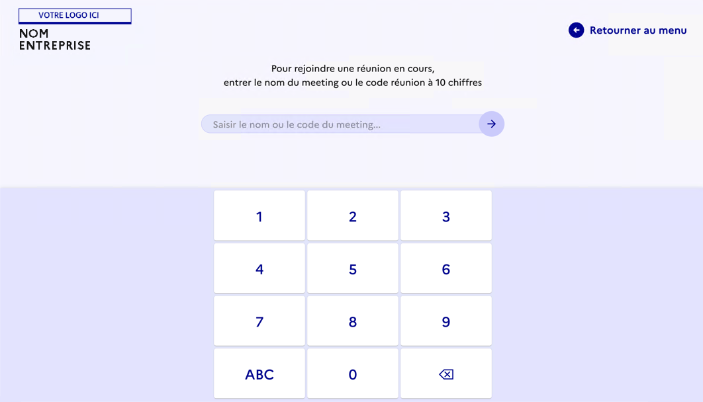

# Code de conférence 

Cette fonctionnalité depend d'un conf mapper.
Elle est à retravailler pour etre intégré comme un plugin et non comme une fonctionnalité de base.

Entrer dans une conference via son code plutot que via son nom.

## API & Commands

Convertrir le code en nom via l'api du confmapper :     
Requêtes GET sur un URL avec le paramètre code
  -	Authentification par API Key (cf. mail suivant), dans le header Authorization
    (ex: `curl [...] -H 'Authorization: Api-Key XXXXXXX'` )
  -	Résultat en JSON
    (ex: `{ "name": "webconfconfmapper2022", "code": "0123456789" }` )