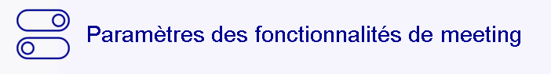

# Afficher / Masquer les fonctionnalités

Cette fonctionnalité permet de facilement afficher les fonctionnalités utilisés et masques les fonctionnalités non utilisés sur les Jitsi Box pro.

Après avoir entré dans l'espace administrateur vous pouvez afficher et masquer les fonctionnalités shouitees.

Voici un exemple du bouton:

