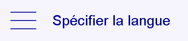

# Choix de la langue (EN/FR)

Cette fonctionnalité permet de facilement changer la langue affichée sur la Jitsi Box pro.

Après avoir entré dans l'espace administrateur vous pouvez changer la langue de la Jitsi Box.

Voici un exemple du bouton:

