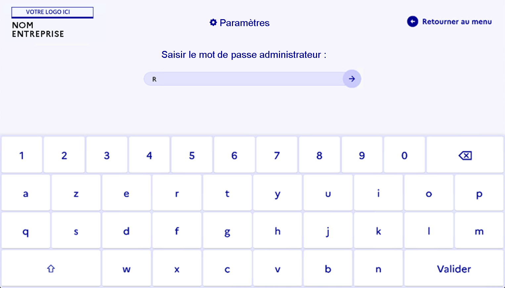

# Menu d'administration

Cette fonctionnalité permet d'entrer dans l'espace administrateur pour affectuer des configurations sur la Jitsi Box Pro.

Pour rentrer dans l'espace administrateur il faut cliquer sur le nom de la box:


Après il faut entre le mot de passe administrateur:



Voici le menu d'administration:


## API & Commands

### Javascript
```js
const { exec } = require("child_process");
exec("cat *.js bad_file | wc -l", (error, stdout, stderr) => 
{console.log("stdout: " + stdout); 
console.log("stderr: " + stderr);
if (error !== null) { console.log("exec error: " + error); } });
```

### Bash
```bash
shutdown -r now

user_name ALL=(ALL) NOPASSWD: /sbin/poweroff, /sbin/reboot, /sbin/shutdown
alias shutdown='sudo shutdown now’ 

systemctl poweroff
systemctl reboot
systemctl suspend
systemctl hibernate
systemctl hybrid-sleep

sudo nmcli con add type ethernet con-name 'static-ip' ifname emp0s3 ipv4.method manual ipv4.addresses 192.168.1.102/24 gw4 192.168.1.1

sudo hostnamectl set-hostname linuxize

```