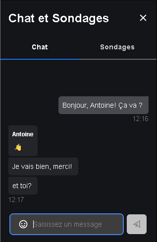

# Afficher Tchat

Afficher/Masquer la fenêtre de tchat du meeting sur l'écran principal via la tablette. Voici un exemple des boutons possibles:

Le bouton durant un appel:

La fenêtre du tchat sur l'écran:

## API & Commands
**Iframe API Events** : pour avoir le statut
- mis à jour du tchat
    - Est ouvert : boolean
    - Compte non lu : nombre des messages non lus
    - Message entrant (de, surnom, privée, message)

**Iframe API commands** : pour afficher ou masquer
`api.executeCommand('toggleChat’);`

**Configuration disabledNotifications** : affiche les notifications de tchat
`disabledNotifications: ['notify.chatMessages'];`
