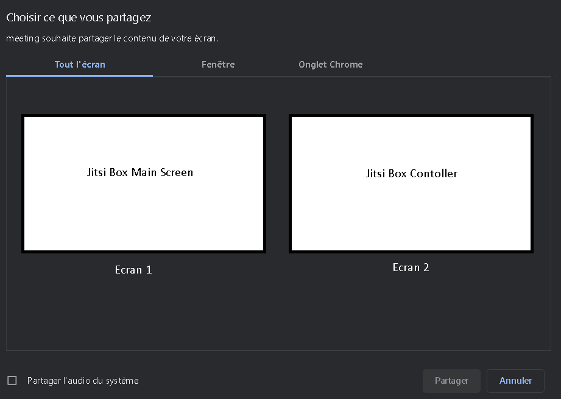

# Diffusion de contenu

Cette fonctionnalité permet un utilisateur de la Jitsi Box de diffuser son contenu en branchant son PC à la Jitsi Box avec un câble USB C. Après avoir branché son PC il suffit de clicker sur le bouton de partage.

Voici un exemple du bouton:

## Points de blocage

Le flux de partage est reconnu comme le flux d’une deuxième caméra:

Le flux de partage n'est pas présent sur le partage de contenu et la tablette USB (Contoller) est vu comme un deuxième écran :

