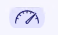
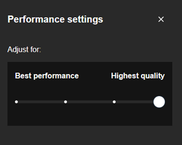

# Modification de la qualité de l'appel

Cette fonctionnalité permet de changer la qualité de votre appel. 

Voici un exemple du bouton:

Le bouton durant un appel:

Voici le panneau de réglage de la qualité d'appel:

## API & Commands

### Commands

**GET** : Renvoie le paramètre de qualité vidéo actuel. [(Lien)](https://jitsi.github.io/handbook/docs/dev-guide/dev-guide-iframe-functions#getvideoquality)

    api.getVideoQuality();

### Commands

**SET** : Définit la résolution vidéo d'envoi et de réception. Le réglage de la hauteur de la résolution est implémenté en utilisant un seul argument. [(Lien)](https://jitsi.github.io/handbook/docs/dev-guide/dev-guide-iframe-commands#setvideoquality)

    api.executeCommand('setVideoQuality', 1080);

### Events

**Event** : Fournit des notifications d'événements concernant les modifications des paramètres de qualité vidéo. [(Lien)](https://jitsi.github.io/handbook/docs/dev-guide/dev-guide-iframe-events#videoqualitychanged) 

L'écouteur reçoit un objet ayant la structure suivante :

    {
        videoQuality: numéro // la hauteur de la résolution liée au nouveau paramètre de qualité vidéo.
    }