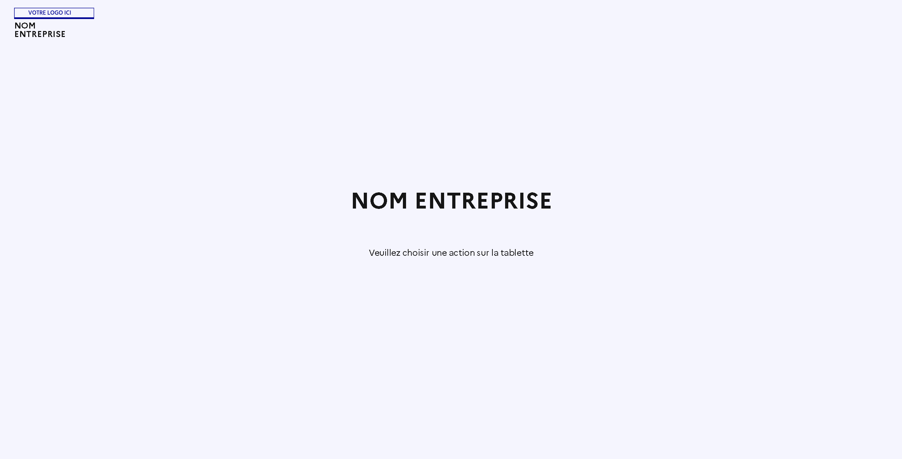

# Présentation de l'interface

## Ecran

Interface d’accueil sur l'ecran:

Interface d'appel sur l'ecran:

## Tablette – tactile
#### Interface d’accueil:

- Créer une réunion
- Rejoindre une réunion
- Partager l’écran

#### Interface creation d'une conference:

#### Interface joindre une conference:

#### Interface partager l'ecran:

#### Interface en cours de réunion:
- Couper le micro
- Couper la caméra
- Demander la parole
- Partager l’écran/Afficher le chat

